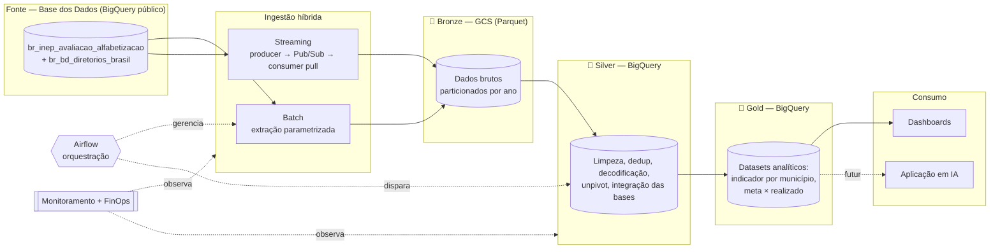

# Alfabetização Lakehouse — Tech Challenge Fase 2

**Pipeline híbrido (batch + streaming) para análise do Indicador Criança
Alfabetizada no Brasil**, em arquitetura medalhão sobre Google Cloud, com foco
em qualidade de dados, governança, observabilidade e otimização de custos
(FinOps).


---

## Índice

1. [Contexto do Problema](#1-contexto-do-problema)
2. [O Desafio](#2-o-desafio)
3. [Arquitetura da Solução](#3-arquitetura-da-solução)
4. [Fluxo de Dados](#4-fluxo-de-dados)
5. [Fontes de Dados](#5-fontes-de-dados)
6. [Tecnologias Utilizadas](#6-tecnologias-utilizadas)
7. [Decisões Arquiteturais (Trade-offs)](#7-decisões-arquiteturais-trade-offs)
8. [Qualidade e Governança de Dados](#8-qualidade-e-governança-de-dados)
9. [Monitoramento e Observabilidade](#9-monitoramento-e-observabilidade)
10. [FinOps](#10-finops)
11. [Aplicação em IA](#11-aplicação-em-ia)
12. [Estrutura do Repositório](#12-estrutura-do-repositório)
13. [Como Executar](#13-como-executar)
14. [Fluxo de Trabalho Git](#14-fluxo-de-trabalho-git)
15. [Status e Responsabilidades](#status-e-responsabilidades)

---

## 1. Contexto do Problema

A alfabetização na infância é um pilar do desenvolvimento educacional, social e
econômico do país. O **Compromisso Nacional Criança Alfabetizada (CNCA)**
mobiliza União, estados, DF e municípios para garantir que toda criança esteja
alfabetizada até o final do 2º ano do ensino fundamental, com meta de
universalização até 2030.

Em 2023, a Pesquisa Alfabetiza Brasil (Inep) definiu o ponto de corte de **743
pontos** na escala Saeb como o nível a partir do qual uma criança é considerada
alfabetizada. Desse parâmetro nasceu o **Indicador Criança Alfabetizada (ICA)**,
que expressa o percentual de estudantes que atingem esse patamar.

Entender os fatores que influenciam a alfabetização exige integrar fontes
heterogêneas — metas nacionais, estaduais e municipais, dados territoriais,
microdados e indicadores de desempenho. Este projeto constrói a plataforma de
dados que sustenta essa análise, atuando como o time de engenharia de dados de
uma organização pública de análise educacional.

## 2. O Desafio

Construir uma pipeline escalável em nuvem que realize ingestão híbrida (batch +
streaming), tratamento e integração de fontes, uma camada analítica confiável,
monitoramento operacional e controle de custos — seguindo a **Arquitetura
Medalhão** (Bronze → Silver → Gold).

## 3. Arquitetura da Solução

### 3.1 Lakehouse híbrido no GCP

A solução combina data lake e data warehouse:

- **Bronze** — Parquet no **Google Cloud Storage** (dado bruto, imutável,
  barato; cara de *lake*).
- **Silver e Gold** — **BigQuery**

A escolha aproveita a **localidade dos dados**: a fonte (Base dos Dados) já
reside no BigQuery, eliminando movimentação e custo.

### 3.2 Diagrama da pipeline



### 3.3 Camadas Medalhão

| Camada | Onde | Responsabilidade |
|---|---|---|
| **Bronze** | GCS (Parquet) | Dados brutos, sem transformação, histórico preservado. Partição por `ano`. |
| **Silver** | BigQuery | Limpeza, dedup, tratamento de nulos, padronização, decodificação de dicionários, *unpivot* das metas, integração das bases. |
| **Gold** | BigQuery | Datasets analíticos modelados, particionados/clusterizados, prontos para dashboards, estatística e ML. |

## 4. Fluxo de Dados

1. **Batch** — tabelas históricas extraídas da Base dos Dados e aterrissadas
   como Parquet particionado no GCS (Bronze).
2. **Streaming** — um *producer* simula a janela de coleta republicando uma
   amostra de `alunos` como eventos no Pub/Sub; um *consumer* Python (pull)
   micro-batcheia e grava no Bronze.
3. **Ponte** — external tables no BigQuery leem o Parquet do GCS sem cópia.
4. **Silver** — scripts limpam, integram e padronizam.
5. **Gold** — scripts derivam os datasets analíticos.
6. **Consumo** — dashboards conectam ao Gold.

## 5. Fontes de Dados

Dataset `basedosdados.br_inep_avaliacao_alfabetizacao` (Inep) + diretório
geográfico `basedosdados.br_bd_diretorios_brasil.municipio`.

| Entidade | Tabela | Grão |
|---|---|---|
| UF | `uf` | ano, sigla_uf, serie, rede |
| Meta Brasil | `meta_alfabetizacao_brasil` | ano, rede |
| Meta UF | `meta_alfabetizacao_uf` | ano, sigla_uf, rede |
| Meta Município | `meta_alfabetizacao_municipio` | ano, id_municipio, rede |
| Município | `municipio` | ano, id_municipio, serie, rede |
| Alunos | `alunos` | microdado atômico (~2M/ano) |
| Dimensão geográfica | `br_bd_diretorios_brasil.municipio` | id_municipio |

### 5.1 Achados de discovery (determinam a modelagem)

- **`id_municipio`**: STRING de 7 dígitos (IBGE completo) em todas as tabelas.
- **`rede` é hierarquia, não dimensão**: códigos `0/5/6` são agregados de
  `1/2/3/4` — somar tudo causa dupla contagem. Os agregados **não são
  deriváveis** das atômicas (cobertura irregular); usar o pré-calculado da fonte.
- **`serie` constante** (`2` = 2º ano do EF).
- **Cobertura não censitária**: ~5.550 municípios nos resultados (vs. 5.570).
- **Metas em formato WIDE** (`meta_2024..2030`) → exigem *unpivot*.
- **Cobertura temporal assimétrica**: resultados 2023–2024; metas até 2030.
- **`peso_aluno` obrigatório**: toda taxa é ponderada, não contagem simples.
- **Filtro de validade**: só `presenca=1 AND preenchimento_caderno=1` conta.
- **Corte de alfabetização**: `proficiencia >= 743`.
- **Validação oficial**: o pipeline reproduz o indicador do MEC — **56,0% (2023)**
  e **59,2% (2024)** — usado como teste de sanidade.

Detalhamento em [`docs/handoff-silver.md`](docs/handoff-silver.md).

## 6. Tecnologias Utilizadas

| Tecnologia | Papel | Justificativa |
|---|---|---|
| Google Cloud Storage | Bronze (lake) | Armazenamento barato de dado bruto em Parquet. |
| BigQuery | Silver/Gold (warehouse) | Serverless, cobrança por bytes escaneados (FinOps transparente), localidade com a fonte. |
| Google Pub/Sub | Transporte de streaming | Broker gerenciado nativo do GCP. |
| Python | Ingestão | Scripts de extração e producer/consumer. |
| Git / GitHub | Versionamento | Histórico, branches e PRs com decisões justificadas. |

## 7. Decisões Arquiteturais (Trade-offs)

### 7.1 Batch vs. Streaming
O dado é anual (batch por natureza); o streaming é uma **simulação** da janela
de coleta. `alunos` entra por **batch** (carga de volume) e **streaming**
(demonstração de fluxo) — papéis distintos, não redundância. Consumo via
**consumer Python (pull)** para manter coerência Bronze-as-lake e legibilidade;
BigQuery subscription descartada por aterrissar no warehouse.

### 7.2 Data Lake vs. Data Warehouse
Híbrido (lakehouse): Bronze como lake (GCS/Parquet), Silver/Gold como warehouse
(BigQuery). Atende à preservação do bruto e à performance analítica.

### 7.3 Custo vs. Performance
Particionamento por `ano`, clustering por `sigla_uf`, Parquet colunar,
proibição de `SELECT *` e dry-run sistemático. O partition pruning foi a maior
alavanca medida (256 MB → 125 MB na `alunos`).

### 7.4 `rede` como hierarquia
Agregados não deriváveis das atômicas → consumir o pré-calculado da fonte
(`rede=5` para o indicador público oficial), evitando divergência.

### 7.5 Databricks / Delta Lake descartados
O dado já reside no BigQuery, que já oferece ACID, versionamento e MERGE nativos.
Trazer Delta/Spark duplicaria capacidade e adicionaria custo de movimentação
sem ganho — o volume também não justifica um motor de escala.

### 7.6 Autenticação via ADC
Criação de chave JSON bloqueada por política; autenticação via **Application
Default Credentials** (credenciais de usuário), eliminando credencial de longa
duração do ambiente. Decisão de governança documentada.

### 7.7 Location fixada em `us-central1`
Bucket, datasets e queries todos em `us-central1` (co-locação + free tier).
`US` (multi-região) ≠ `us-central1` (regional) — misturar gera erros silenciosos.

## 8. Qualidade e Governança de Dados

Regras implementadas como **testes nativos do dbt** (declarativos, versionados):
`unique` (grão), `not_null` (chaves/métricas), `relationships` (integridade
referencial). Casos específicos já mapeados:

- **Deduplicação** de reentregas do streaming (Pub/Sub *at-least-once*) via
  `row_number()` por `id_aluno, ano`.
- **Validação cruzada** do corte de 743: coluna re-derivada vs. oficial.
- **Filtro de validade** como flag, não delete (preserva auditabilidade).

**Governança de acesso:** IAM com menor privilégio — cada integrante lê da
camada anterior e escreve na sua; ninguém recebe Owner/Editor de projeto nem
acesso a faturamento. Ver [`docs/onboarding-acesso.md`](docs/onboarding-acesso.md).


## 9. FinOps

**Objetivo de custo: ≈ R$ 0**, operando dentro do free tier (BigQuery 1 TiB/mês).

- **Billing alert** em valor baixo (dispara quando algo está *errado*).
- **Custom quotas** de consulta por usuário/projeto (proteção proativa; aplicadas
  após ativação da conta paga).
- **Parquet + particionamento por `ano` + clustering** reduzem bytes escaneados.
- **Compressão colunar medida**: ~3,9M linhas de `alunos` → ~63 MB Parquet
  (vs. 256 MB de varredura no BQ).
- **Dry-run** antes de cada query; proibição de `SELECT *`.
- **Restrição de escopo**: apenas a ingestão consulta a Base dos Dados; as
  camadas superiores trabalham sobre o Bronze (pequeno).

## 10. Aplicação em IA

A camada Gold é preparada para alimentar:

- **Predição de alfabetização por município** — risco de não atingimento da meta
  a partir de features socioeconômicas e territoriais (via enriquecimento).
- **Clusters de vulnerabilidade educacional** — agrupamento de municípios por
  perfil, direcionando políticas públicas.
- **Análise de desigualdade** — decomposição do indicador por rede, região e
  trajetória meta × realizado.

> Método: features de proficiência devem usar agregação **ponderada**
> (`peso_aluno`); para classificação desbalanceada, PR-AUC é mais honesta que
> ROC-AUC. *(Camada de IA conceitual — sem treinamento no escopo da entrega.)*


## 11. Como Executar

Pré-requisitos: conta GCP com acesso ao projeto, `gcloud`/ADC configurado,
Python 3.12+. Guia completo em [`docs/onboarding-acesso.md`](docs/onboarding-acesso.md).

```bash
cp .env.example .env             # preencher com os valores do ambiente
pip install -r requirements.txt

# Autenticação (ADC)
gcloud auth application-default login
gcloud config set project grupo-pos-fase-2-alfabetizacao

# Ingestão
python ingestion/batch/extract.py                 # batch → Bronze
python ingestion/streaming/producer.py --uf AC --ano 2024 --limite 200
python ingestion/streaming/consumer.py --lote 50 --timeout-ocioso 15
python ingestion/create_external_tables.py        # ponte → BigQuery
```

A ingestão é **idempotente** e **determinística** (reproduz 11.547/12.448 linhas
em `bronze.municipio`).

## 12. Fluxo de Trabalho Git

- Branch `main` protegida — merge apenas via Pull Request.
- Uma *feature branch* por bloco de trabalho.
- PRs com descrição que **justifica a decisão**, revisados antes do merge.
- Após mergear um PR, sincronizar a `main` local antes de abrir nova branch.
- `.gitignore` protege credenciais (`*.json`, `.env`), artefatos (`target/`),
  Parquet local e `*:Zone.Identifier` (WSL2/Windows).

